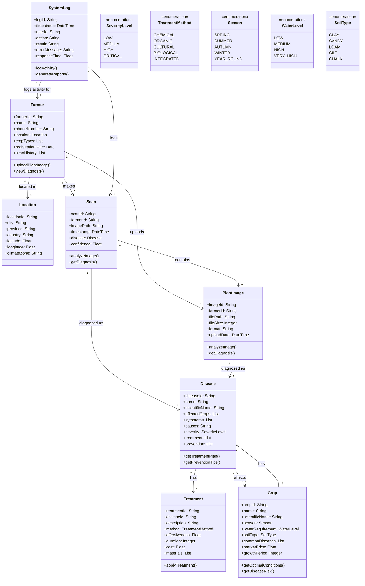

# AgriScan System - Domain Class Diagram

## Overview
The domain class diagram represents the key entities (things) in the AgriScan crop disease detection system. These classes represent the core business concepts and their relationships.

## Class Descriptions

### Core Entities

1. **Farmer**: Represents the primary user of the system
   - Contains personal and farm information
   - Uploads plant images for diagnosis
   - Views scan history and results

2. **Location**: Geographic information for regional context
   - Supports location-based services

3. **Scan**: Represents a plant disease diagnosis request
   - Links image input to diagnosis results
   - Contains timestamp and confidence data

### Agricultural Domain

4. **PlantImage**: Images for disease diagnosis
   - Image processing and analysis
   - Diagnosis results

5. **Disease**: Plant diseases and their management
   - Comprehensive disease information
   - Treatment and prevention strategies

6. **Treatment**: Disease treatment methods
   - Multiple treatment approaches
   - Effectiveness and cost information

7. **Crop**: Agricultural products and their characteristics
   - Links diseases and treatments
   - Contains growing requirements

### System Support

8. **SystemLog**: System activity tracking
   - Usage analytics and reporting
   - Performance monitoring

## Key Relationships

- **Farmer** uploads **PlantImage** which becomes a **Scan**
- **Scan** is diagnosed as a **Disease**
- **Disease** and **Treatment** form the knowledge base for plant health
- **Crop** connects agricultural products to diseases

## Design Principles

1. **Single Responsibility**: Each class has a clear, focused purpose
2. **High Cohesion**: Related attributes and methods are grouped together
3. **Low Coupling**: Classes are loosely connected through well-defined relationships
4. **Domain-Driven Design**: Classes reflect real-world agricultural concepts
5. **Extensibility**: Easy to add new crops, diseases, and treatments
