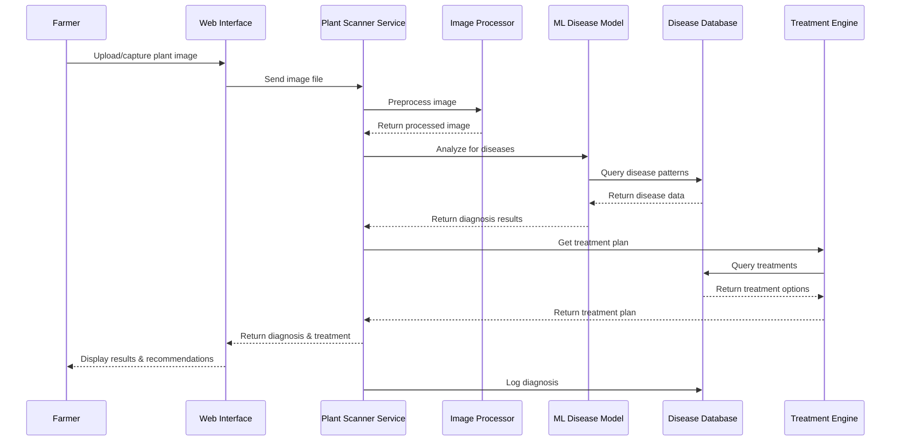
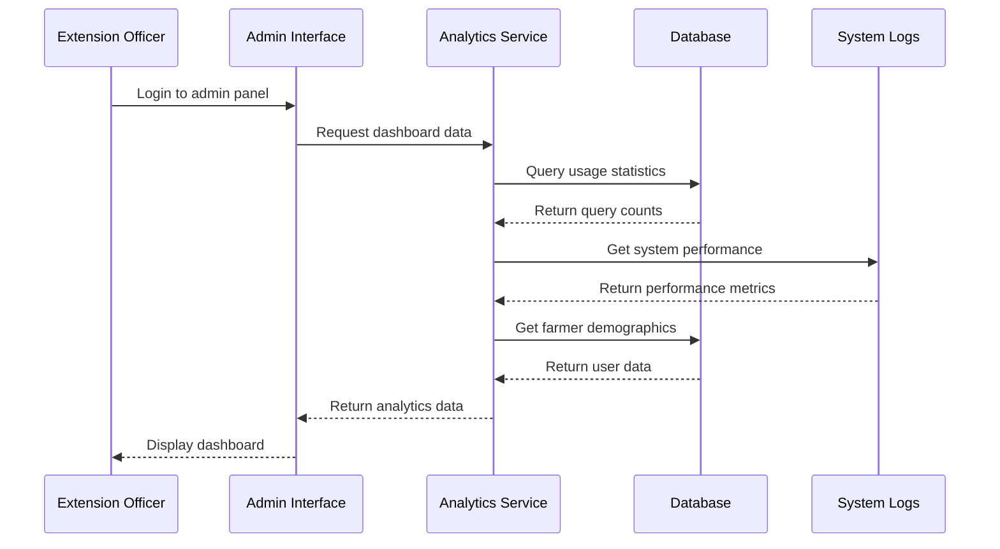
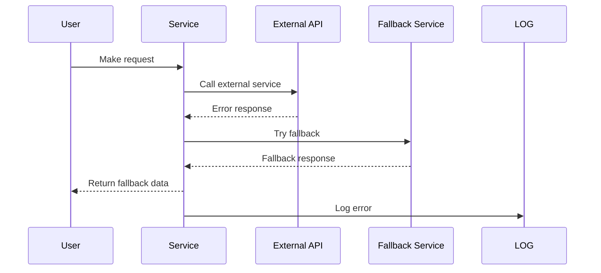
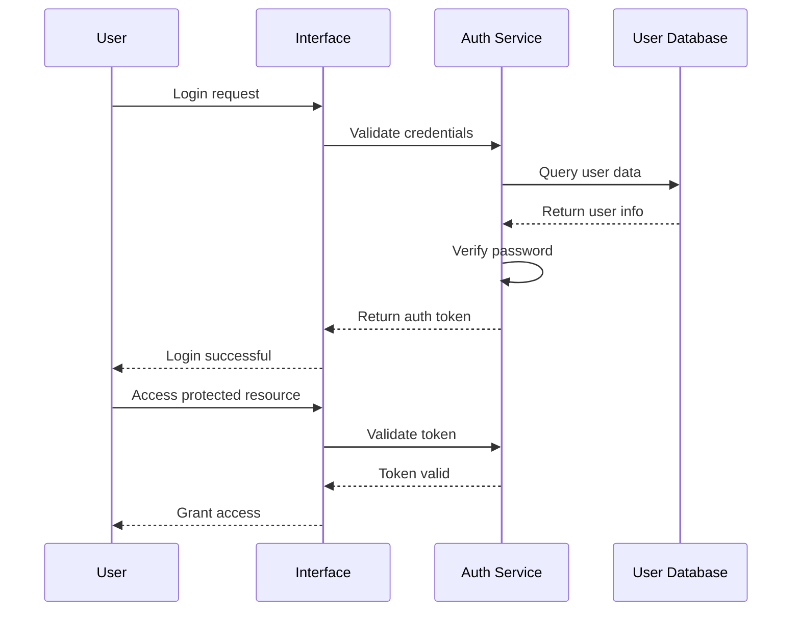

# AgriScan System - Sequence Diagrams

## Overview
This document contains simplified sequence diagrams for key use cases in the AgriScan crop disease detection system. Each diagram shows the interaction flow between actors and system components.

## 1. Plant Disease Diagnosis

## 2. System Monitoring and Analytics

## Common Patterns

### Error Handling Pattern

### Authentication Pattern

## Performance Considerations

1. **Caching**: Analysis results cached for repeat scans
2. **Async Processing**: Image analysis runs asynchronously
3. **Database Indexing**: Query logs indexed by timestamp and user
4. **CDN**: Static assets served via CDN

## Security Measures

1. **Input Validation**: All user inputs validated
2. **Rate Limiting**: API calls limited per user
3. **Encryption**: Sensitive data encrypted in transit and at rest
4. **Audit Logging**: All system interactions logged
