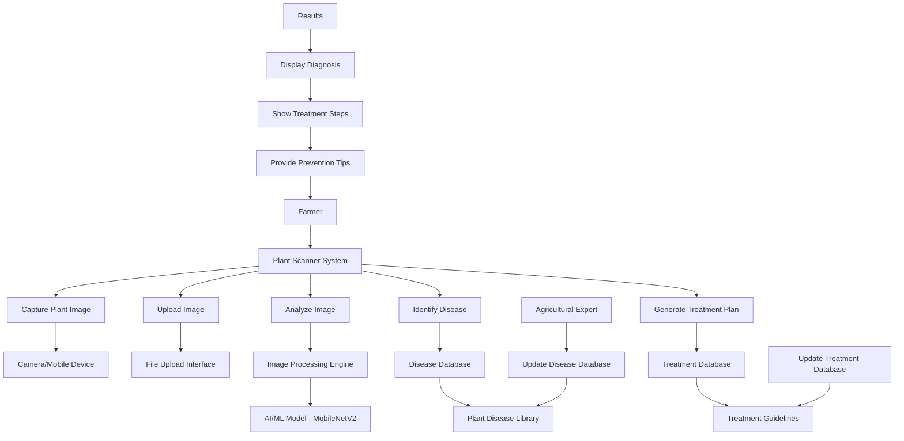

# AgriScan System - Use Case Diagrams

## Overview
AgriScan is an AI-powered crop disease detection system that allows farmers to upload images of diseased plants through a web browser and receive instant diagnostic results. The system uses deep learning to identify crop diseases and provide treatment recommendations.

## System Modules

### 1. Plant Disease Scanner Module

**Use Cases:**
- **UC-1:** Capture Plant Image
- **UC-2:** Upload Plant Image
- **UC-3:** Analyze Plant Disease
- **UC-4:** View Diagnosis Results
- **UC-5:** Get Treatment Recommendations

## Actor Definitions

### Primary Actors:
- **Farmer:** Main user of the system, seeks plant disease diagnosis
- **Agricultural Expert:** Updates disease databases and treatment information

### Secondary Actors:
- **TensorFlow/Keras:** Deep learning framework for model inference
- **MobileNetV2:** Pre-trained CNN model for image classification
- **Web Browser:** Provides image upload and results display

## System Boundaries

The AgriScan system integrates with:
- Deep learning models for image classification
- Local databases for agricultural knowledge
- Web browsers for user interaction
